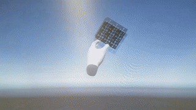
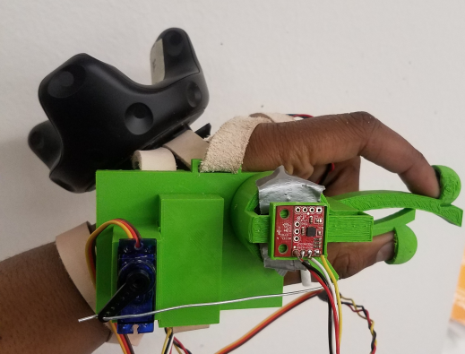
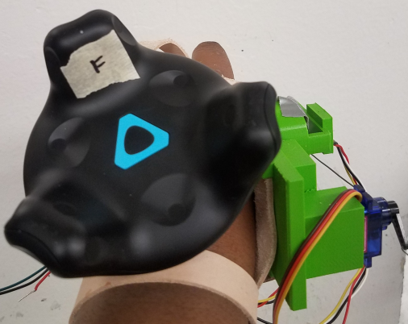
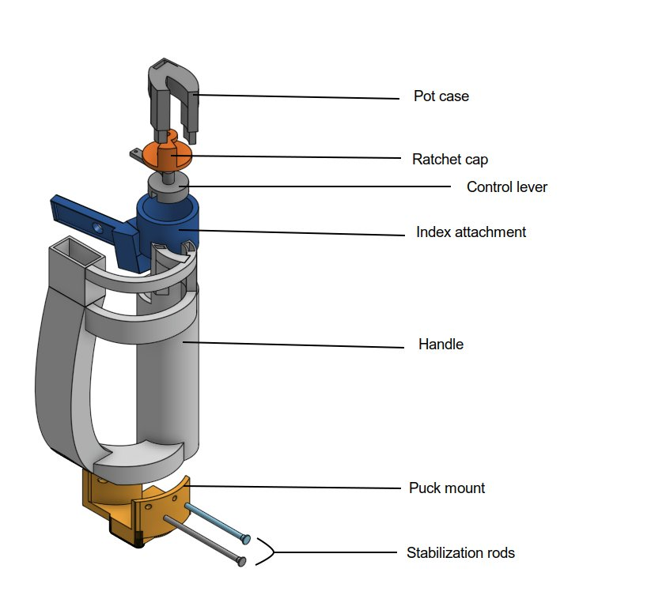
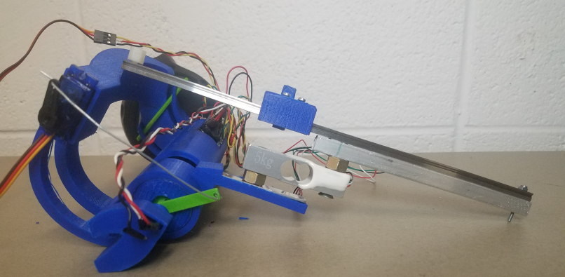
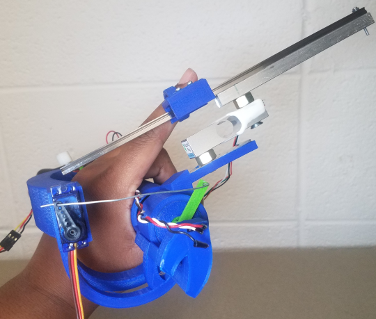

Date: December 2018

Category: Mechatronics, Mechanical Design, VR

&nbsp;
&nbsp;

# VR glove that provides force feedback and simulation

&nbsp;
&nbsp;

## Software

Arduino, C#, Python, Unity

&nbsp;
&nbsp;

# Project description

<video width="500" controls style="margin-left:auto; margin-right:auto;display:block;">
  <source src="./proj/FInal/final3.webm" type="video/webm">
Your browser does not support the video tag.
</video>

The goal of this project is to create a  virtual reality simulation utilizing the HTC Vive VR system as well as designing a hand held device that provides force feedback to the user when interfacing with the virtual reality simulation. The design of the glove was inspired by the shape of the steam  knuckles and Oculous touch controller. Like other VR peripherals the glove is wireless and has a low power consumption due to its passive mechanical breaking system.The simulation creates a realistic physics environment with which the user can interact with the Unity game engine.
&nbsp;
Presented below is an in-depth discussion of the project.
To see the github repository for this project follow this [link](https://github.com/Laurenhut/VR-force-glove).

The repository contains instructions on how to build and run the software to use the glove.
&nbsp;
&nbsp;

### Creating the Virtual reality simulation  

When creating the virtual reality simulation  Unity was chosen as the game engine. This engine was selected instead of The Unreal engine due to the availability of first party support of the Vive SDK. The platform also provides a large and active development community. The final and arguably one of the most important benefits of the Unity engine is that it can be freely accessed by hobbyists and students. This is a feature that the Unreal engine did not have at the time of this development.
  

The goal in creating this initial version of the simulation is to create a world that can interact realistically with the user and simulated objects. We wanted the simulation to look reasonably realistic in terms of the underlying physics of how objects move and react to each other. Therefore, the base Unity physics engine could not be utilized. It was found to be a suboptimal choice due to how easily the  virtual hand model clipped through objects and collision detection never triggered. This was found to break the real world sense of immersion into the simulation. To remedy the clipping issue a package called Newton VR was used. Newton VR is an open source physics engine that overhauls the inbuilt Unity engine to create more realistic physics interactions. The most relevant feature to this package is that Newton VR objects cannot clip through each other.

Once the new physics simulation using Newton VR was integrated, a proximity based parenting system was created. This was accomplished using a method called raycasting. This system permits a grasped object to have the same transform as the user's hand object when the object is within a certain proximity of both the index and thumb fingers. This gives the visual sensation that the hand has actually picked up the object.
&nbsp;
&nbsp;

Interfacing with the glove
===

Interfacing between the glove and the simulation is achieved by a relatively straightforward solution. The position of the glove in free space is determined using the Vive puck and the proprietary tracking algorithms provided in the Vive SDK. The information describing the degree angles for the actuation of the index finger is communicated to the simulation. Information is also returned from the simulation to the glove which determines if the glove should be locked or unlocked. This is sent via serial communications using an off the shelf Bluetooth module.  

Unity is a game engine and only accepts inputs from gaming peripherals such as a mouse and keyboard or from a steam compatible gamepad. Since the glove needs to send numerical data as a stopgap measure after data is received from the serial communications line it is then converted into joystick data using a Xbox virtual controller. This controller is able to connect to Unity through the Steam VR interface. The downside to using a virtual controller is that there is not two way communication between the controller and the simulation. Data pertaining to whether the glove should be locked or unlocked cannot be sent back through the virtual controller using features such a rumble or changing the values for the lights.  To get around this issue the windows 32 API can be accessed through C# to take control of the keyboard and toggle function keys like caps lock, number lock, or scroll lock.  With the ability of these keys to be toggled by Unity, their current state can be used to determine when an object is being grasped which signals data back to the Arduino to activate the motor to lock or unlock the glove,
&nbsp;
&nbsp;

Mechatronics in the glove
===

In order for the glove to communicate with the simulation environment it needed a few basic features.

1. A way to determine what angle the finger is being held.

	This is accomplished by a potentiometor attached at the center of the ratchet case.

2. A locking/unlocking mechanism

   It was decided to use a passive locking system because it is less battery intensive. Also a force feedback that could be built without specialized motors or parts but could achieve the same amount of stopping power as a passive system. The locking mechanism that was chosen was a ratchet because of its simplicity and the high amount of stopping power a small ratchet can achieve when locked. Changing the ratchet from a freewheeling position to a locked position is accomplished using a small hobbyist motor connected to an Arduino.

3. Communication method with the Vive computer

   To communicate with a Vive computer an off the shelf Bluetooth module was used. The choice to use Bluetooth over a wired connection avoids the possibility that a user will get caught or tripped up when moving around the VR workspace by hanging wires.

4. A way to determine if the user is trying to apply force to a grasped object or trying to release   object one

    This is achieved by a force sensor/ strain gauge attached to the index finger. When the glove is locked and the user is squeezing down the position of the index finger will cease to update. When the user has released pressure on the device the index finger is once again able to send updated positions.

&nbsp;
&nbsp;

Designing the glove
===

The glove went through two rounds of design.
 The first design of the glove was a very basic model for a proof of design. It was not focused on ergonomics or ease of usability and was mostly focused on proving that the use of a ratchet as the locking mechanism was a viable solution.

 
 

 The major flaws in this design were as follows. First the difficulty in putting the glove on.  Second the force sensor used was quite flimsy and had a high possibility of breaking or slipping out of position. The index and thumb cups on the end of each of the protrusions were uncomfortable to use and awkward to hold when trying to move your index finger. The cups on the end were quite painful in that they cut into the skin. Finally the Vive puck was not very securely attached to the hand. This caused the orientation and angle inside the simulation to be incorrect when the device was active.

 The glove went through a cosmetic redesign to fix the problems found in the first design.  Most important was a change in ergonomics. In the redesign the new shape was based off of the general looks of the steam knuckles or the Oculous hand controllers.
  
  
  This is a design that wraps around the hand and is secured by the distal three fingers from the thumb. The mechanical components have remained constant in form through the design process. The original force sensor and index finger protrusion have been completely replaced by the addition of a strain gauge with a linear slide mounted on top. In the new design the ratchet head is spun by pushing and pulling on a ring that slides up and down a linear slide attached to the strain gauge. This mode of actuation proved to be less awkward to use than the original finger cuff method. It also allowed for different finger sizes and lengths to comfortably use the glove.

&nbsp;
&nbsp;

Drawbacks of the design and simulation
---
 

The current design and simulation is a functional prototype but there are many improvements which can be envisioned. One area of improvement would be the way the device acts under load. While the ratchet is locked and the user is squeezing the device the ratchet cannot be unloaded unless the user releases pressure and retracts their hand slightly. This limits what can be done in the simulation and can also affect the immersion experience.
There are also a few weak points in the physical design of the glove. For example the push rod that locks and unlocks the ratchet can be bent or broken easily. Ideally the control rod would be made out of sturdier material, could be shortened, or a solution that attaches the motor directly to the ratchet head could be devised. With the current design the distance the motor needs to be from the control lever  restricts the size of the device. The device would be optimally user friendly if it were a smaller, less cumbersome size.
&nbsp;
&nbsp;

Expansion of this project
---

To make the prototype even more feature complete a few additions could be made. Modifying the design to better hide exposed wires by running channels through the devices body. Creating housing within the handle portion of the glove to fit the strain gague amplifier and a battey compartment would clean up the look of the device tremendously.
Another possible expansion would be to create a more interesting simulation environment that better showcases the ability of the glove similar to many of the vr tech demos available on the Oculous store or Steam.  
One last possible extension wold be extending the force feedback to multiple fingers.
&nbsp;
&nbsp;
