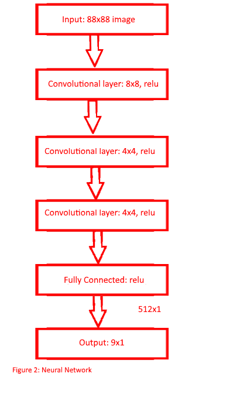

<!-- {: .img-center} -->

Date: December 2018

Category: Mechatronics, Mechanical Design, VR

&nbsp;
&nbsp;

# Virtual reality glove that provides force feedback 

&nbsp;
&nbsp;

## Software

Arduino, C#, Python, Unity

&nbsp;
&nbsp;

# Project description
<!-- 
<!-- {: .img-center} -->

The goal of this project is to create a  virtual reality simulation utilizing the HTC VIVE  VR system as well as designing a hand held device that provides force feedback to the user when interfacing with the virtual reality simulation.

paragraphs to talk about 
- creating the unity simulation 
	- unity was chosen over a different engine because of its multitude of available packages and the easy integration with the vive system 
	- the unity simulation isat the moment quite basicit consists of the hand object with two interactable objectsto pick up 
		- because we wanted to simulation to look as real as possible we couldent use the inbuild unity physics engine because of the inacuracies observed in collisions between the hand bject colliders and the pickup object collider where often times the hand object would pass through the blocks collider causing clipping of the object skins. 
		- to prevent these cliping issues we used the package newton vr an open source physics engine for the unity platform. This package is an overhaul of the unity physics engine to create a model that is more similar to reality. 
		- with the addition of this package collisions between objects became tighter and more reliable. WIth the reliability of collisions increasingthis presented a problem when tryng to grasp an object between the hand's colliders. the object would repeatidly bounch off of the thumb and forfinger colliders until it would eventually bounch out of the grasp 
			- the fix to this is bybreaking each of the finger collders into multiple sections and addign raycasts to each of the segments 
				- this allows the fingers to be able to grasp an object by parenting the block to the hand object if the the raycasts for the index and thumb fingers are triggered while still preserving the utilty of the newton vr package if an object is not being grabbed 
	- this method has its own problems (if an object is small it could completely miss a raycast etc 
	- finally because the only method in which unity accepts inputs is through wither the keyboard/ mouse or a gamepad controller. To actuatethe fingers we use the input of a controllers y- axis to determine the positioning of the index fingers, inorder to signal that an object has been grabbed in the unity enviornment on a successful grab the unty scripts will toggle the capslock key. (on signifies that an oject is being grasped, off means that there is no grasped object) 

- interfacing with the glove 
	- position of the glove in free space is done using the vive puck
	- bluetooth serial communications + virtual controller 
	- challenges 
		- unity will only accept controller inputs so the range of functionality is limited to what a standard gamepad can perform

	- limitations 
		- because of the limitatios of currently availabe virtual controller software the device only runs on windows 
		- bc of the need for two way communications there was no off the shelf solution for hmd communications that can perfrom outgoing and incomming communications
			- ie a rumble feature on a contrller 
			- bc microcontroller are no longer able to communicate with unity through the vive puck 

- design of the glove
	- locking mehcnism 
		- ratchet 
		- it was decided to use a passive locking mechanism
			- less battery intensive 
			- dosnet require as large or oa powerfull of a motor 
			- can be acheived with pretty cheap parts
	- force sensor / strain gague
		- need to bea beable to detect when the user wishes to disengague with the grabbed object 
		- used with unty events eg force bar 
	- design decisions for things like the controll lever used for locking and unlocking the glove 
	- potentiomiter 
		- tried to use an imu but there were issues with drifting values and inconsistancy in the oututted data 

- drawbacks of the design 
	- the way it acts under load 
		- must manually unlock the wratchet when the lever is, will not unload by itself 
	- there are very obvious weak points in the glove (controll lever) which could be bent or broken pretty easily 
	- because the control lever is needed for locking and unlocking the gloe it limits how small the glove can be due to the distance needed between the two partsand the need for the two parts to be in line with each other 

discuss the first version
	- finger cups painful 
	- akward to move fingers 
	- force sensor had a tendancy to slip out of its position
	- vive puck loosly attached to the hand 
	- not very intuitive to use 

discuss the redisigned verson 
	- was determined that given the amount of time the best improvement is to the ergenomics of the glove 
	- changed 
		- replaced force sensor with strain gague 
		- made the device mroe straight forward to use aesthetic look 
		- replaced the straps wih a bar that is grabbed and held the puck is then placed on the end of that bar 
		- made it less akward to move your finger with the glove, uses a slide for the positioning of the finger 

 

 To train the neural network a method called experience replay is used. Experience replay takes a random sample of the agents experiences which are defined by an array containing the following information:

     1. Action taken
     2. Original state
     3. Resulting state
     4. Reward
     5. If Mario died or has completed the level

 

&nbsp;

# Expansion of this project

make a cool simulation

Link to the projects github repository

[source](https://github.com/Laurenhut/Super-Mario-AI)

# References

newton vr 
arduino packages 
virtual controller packages

&nbsp;
&nbsp;
