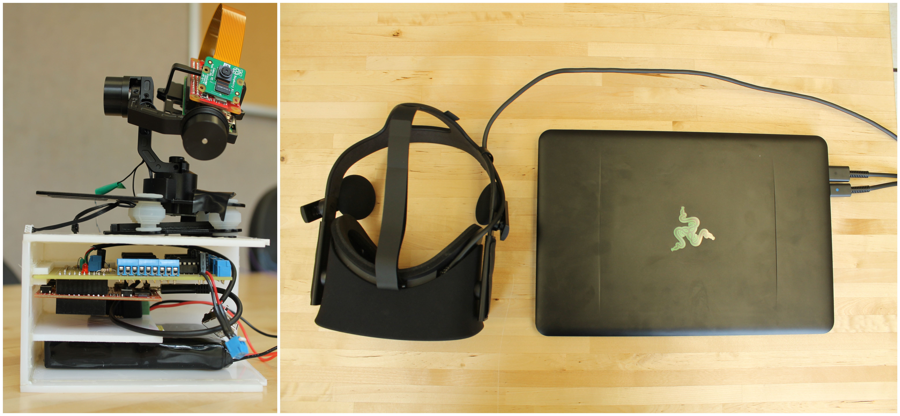

<!-- {: .img-center} -->

   Date: May 2017

   Class: Senior Design

   Category: Control systems, mechatronics, C,

   Partners: Spencer Nelson, Silas Kuchta, Loagan Baerenwald

&nbsp;
&nbsp;

# A new way to tackle remote-person view

&nbsp;
&nbsp;

## Hardware
   HTC Vive, Raspberry Pi, Tiva 123-g development board, Brushless DC Motors

&nbsp;
&nbsp;

# Project descriptions
<!-- 
<!-- {: .img-center} -->

This project address the need for there to be a more engaging first person video experience for hobbyists
    that can utilize commercially available VR headsets. The prototype uses an HTC Vive VR headset connected
    to a Walkera gimbal through a Raspberry Pi Zero and the ARM cortex -M4F microcontroller on the Tiva C 123g
    development board. An API running on the computer connected to the HTC Vive collects the data output of the
    headset, and sends it through WiFi to the prototype. At the same time, real time video is captured with a compact
    camera attached to the Raspberry Pi, and sent back to the computer through a simple web interface.

<!--
&nbsp;
&nbsp;

[source](https://github.com/felix990302/Racket-Algorithms/blob/master/a11/RPS.rkt) -->
