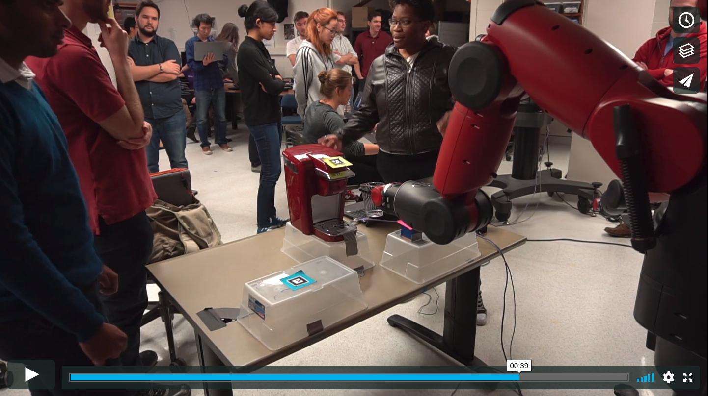

<!-- {: .img-center} -->

Date: December 2017

Class: Embedded systems in robotics

Category: Embedded systems, Robotic Manipulation, Computer Vision, Python

Partners: Solomon Wiznitzer, Ian Davis, Kashish Goyal

&nbsp;
&nbsp;

# Baxter research robot coffee making program.

&nbsp;
&nbsp;

# Hardware

&nbsp;
&nbsp;

# Project description
<!-- 
<!-- {: .img-center} -->

This project utilized the Robotic operating system (ROS), and Computer vision to allow a Baxter research robot to make a cup of coffee using a single serve Keurig machine. A more detailed explanation of the project can be found on its github repository as well as a video of the final results.

&nbsp;
&nbsp;

Below is a link to repository.

[Github Repository](https://github.com/Laurenhut/ME495-final-project)
