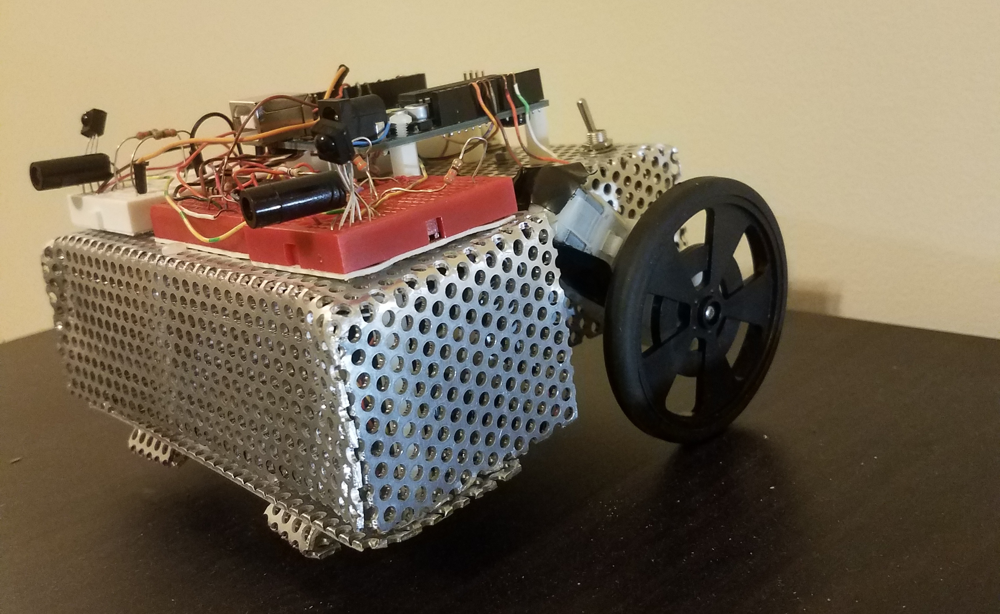
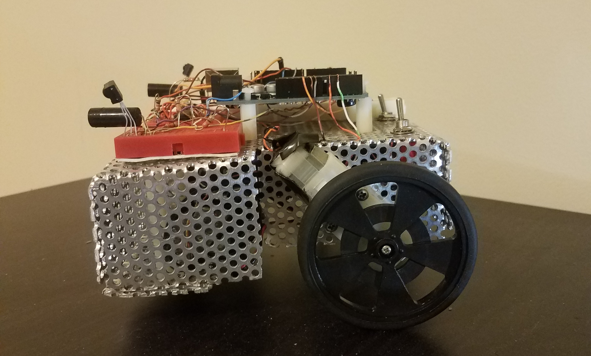

<!-- {: .img-center} -->

Date: Febuary 2015

Class: Systems Interfacing

Category: Mechatronics, Embedded systems, C

&nbsp;
&nbsp;

# Autonomous wrestling robot.

&nbsp;
&nbsp;

## Hardware

Arduino Uno, QTR-1A line sensors, IR sensors, Servo motors

&nbsp;
&nbsp;

# Project description
<!-- 
<!-- {: .img-center} -->

This project was created for a class competition.
    For the competition participants had to create an autonomous
    robot that would participate in a sumo competition.
    With the ultimate goal being that one robot would push its
    opponent out of the Sumo ring.
    For the competition I utilized the ATmega328p
    microcontroller on a modified Arduino development
    board to send PWM signals to the l293d motor
    controllers that determine the speed and direction the wheels turn.

For distance and direction detection two Ir sensors were used at the front of the robot, one on each of the front corners of the robot pointed  45 degrees out from the face of the robot.
The Ir sensors will detect where the opponent is and if the opponent is left, right, or in front of
the robot. When the direction of the opponent is identified the robot would then approach and push its opponent until it
falls outside of the sumo ring.

  The other concern was whether the robot was near to the edge of the sumo ring. When the robot searches for its opponent or
  it is being pushed by the opponent there is a large possibility that it will get close to the edge of the sumo ring. In order to prevent
  the robot from either letting itself get pushed out of the ring or driving itself out of the ring while searching the QTR-1A line sensors were used.
  Through the photo resistor inside of the sensor the QTR-1A line sensors detect the black and white coloring of the sumo ring. If the sensors are detecting the black color of the inner
  ring this means that the robot is currently safe from falling out of the ring and thus can continue searching for an opponent or attempting to push an opponent.
  If the senors are detecting the white of the ring edge it should immediately reverse its direction and return to the center of the ring where it is safe.

  Combining and utilizing all of these sensory inputs in a state machine
  lead to a successful Sumobot that was able to advance into the second
  round of the class competition.

<!--
&nbsp;
&nbsp;

[source](https://github.com/felix990302/Racket-Algorithms/blob/master/a11/RPS.rkt) -->
