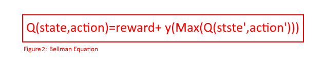

<!-- {: .img-center} -->

Date: March 2018

Category: Artificial Intelligence, Machine Learning, Reinforcement Learning

&nbsp;
&nbsp;

# Super Mario World playing agent.

&nbsp;
&nbsp;

## Software

Python, Lua, Lsnes emulator, Zeromq

&nbsp;
&nbsp;

# Project description
<!-- 
<!-- {: .img-center} -->

The goal of this project is to create an agent that can successfully play Super Mario world for the  SNES inside an emulator.
 In 2013 Google's deep mind published a paper describing how they created an agent that was able to successful replicate human level play in Atari 2600 games using a method called deep Q learning. Deep Q learning (DQN) is a technique that combines the reinforcement learning method of Q-learning with the power of a neural network. This project utilizes the same DQN algorithm albeit with a simplified neural network.

 The Deep Q network will receive the current state of the emulator. The state of the game consists of the following pieces of data  Mario's x and y position, if Mario has collided with an enemy, if Mario is currently on the ground, the number of enemies on the screen from 0-10, and the x & y positions and velocities of up to 10 enemies. This information is extracted from the games registers in a Lua script and sent as an array over a port opened by Zeromq between the Lua and Python scripts. This creates a 72x1 array that is then passed into the neural network represented in the picture in figure 2.
 

 The neural network used in this project was simplified from the convoluted neural network used in the deep mind paper. The network used consists of three fully connected layers with 100 nodes and Softmax activation. Passing the state information through the neural network results in the networks estimation of the maximum future reward at the end of the game for each of the nine possible button commands (do nothing, left, right, up, down, jump, spin jump, jump right, spin jump right) from here forward these values will be referred to as Q-values. The system is given a small positive reward of +1 for increasing the game score, Which is achieved by killing enemies or collecting coins. A large positive reward of +100 is given for reaching the end of a level. A large negative reward of -100 is given to the system for dying and a small negative reward of -1 is given for any other action. Giving this constant negative reward will prevent the agent from remaining in one area and will ultimately prevent it from dying due to  running out of time in a level.
 As per the DQN algorithem the next action performed is the one that has the highest Q-value or it is randomly selected. Allowing for random actions will let the agent more fully explore the possivle options. The chosen action would then be performed on the emulator, after 50 frames of the action being repeated. The resulting state is stored along with the reward gained the actions effect, and whether the emulator has died or reached the end of the level.

 To train the neural network a method called experience replay is used. Experience replay takes a random sample of the agents experiences: action, original state, resulting state, reward, died/at end and updates the Q-value of the original state using the Bellman equation shown in figure 3. This equation updates the Q-value of an action performed at a given state this value is represented by the summation of the reward given to the agent for that action and the maximum discounted Q-value of the resulting state. This method of training will efficiently use the agents experiences by allowing the agent to train multiple times with any one experience.

 

This sequence of events is repeated until the agent has either reached the end of the level or it has died due to running out of time or running into an enemy. In which case the emulator will reset the game back to the beginning of the level.
By replaying the level multiple times the Neural network will be trained to find the most optimal button selection at a given state in the level that will prevent Mario from getting killed and maximize the total reward of the network.

&nbsp;

# Future work on this project

In the future I want to expand the neural network to accept a simple image representation of the ground and blocks, Mario's current position, and enemy/ coin positions in the visible portion of the screen. As well as the information currently provided to the neural network. By adding in the image representation this will give the neural network a more complete information about the current state of the game which will allow for more accurate Q-values.

&nbsp;
&nbsp;

Link to the projects github repository

[source](https://github.com/Laurenhut/Super-Mario-AI)
