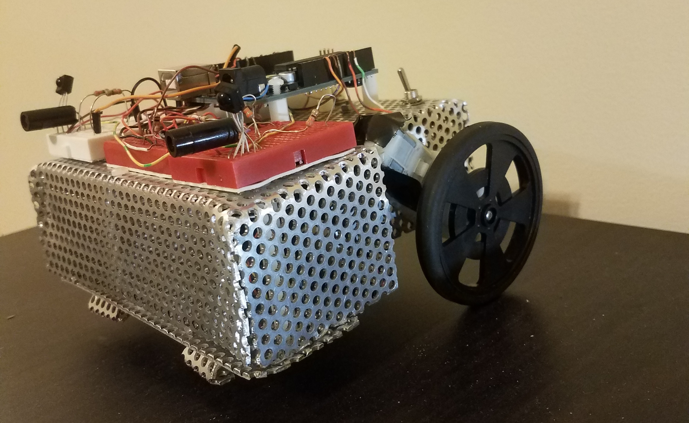

<!-- {: .img-center} -->

Date: March 2018

Category: Artificial Intelligence, Machine Learning

&nbsp;
&nbsp;

# Super Mario World playing agent.

&nbsp;
&nbsp;

## Software

Python, Lua, Lsnes emulator

&nbsp;
&nbsp;

# Project description
<!-- 
<!-- {: .img-center} -->

The goal of this projext is to create an agent that can sucessfully play Super mario world for the SNES in an emulator. 
 In the early 200's goodl deep minds created an agent that was able to sucessfull replicate human leval play in 51 different Atari games using a method called deep Q learning. Deep Q learning is a technique that combines the the reinforcement learning method of Q- learning with the power of a neural network. This project utilizes the same techniques, but on 
 
 When applied to this problem the Depp Q network will Observe the current state of the world then choose a command thats has been provided by the neural network. The result of this action will then be recorded and used in the Q learning heuristic function used to update the weights in the Neural network to provide a more acurate assessment for the next time that state is reached. To avoid having to train for an extrordinarily long time a batch size of x us used to update the weights every timestep. 
 
 To get the curent state of the game from the emulator  the following data is extracted from the games registeres using a lua script and sent to the python script using a port opend by Zeromq the data sent over the port is mario's x and y position, if mario has collided with an enemy, if mario is currently on the ground, the number of enemies on the screen from 0-10, and the x & y positions and velocities of up to 10 enimies. an array of this informaion is then passed through the neural network to create confidance values for each of the possible button presses available to the agent. 
 
 
   

For distance and direction detection two Ir sensors were used at the front of the robot, one on each of the front corners of the robot pointed  45 degrees out from the face of the robot.
The Ir sensors will detect where the opponent is and if the opponent is left, right, or in front of
the robot. When the direction of the opponent is identified the robot would then approach and push its opponent until it
falls outside of the sumo ring.

  The other concern was whether the robot was near to the edge of the sumo ring. When the robot searches for its opponent or
  it is being pushed by the opponent there is a large possibility that it will get close to the edge of the sumo ring. In order to prevent
  the robot from either letting itself get pushed out of the ring or driving itself out of the ring while searching the QTR-1A line sensors were used.
  Through the photo resistor inside of the sensor the QTR-1A line sensors detect the black and white coloring of the sumo ring. If the sensors are detecting the black color of the inner
  ring this means that the robot is currently safe from falling out of the ring and thus can continue searching for an opponent or attempting to push an opponent.
  If the senors are detecting the white of the ring edge it should immediately reverse its direction and return to the center of the ring where it is safe.

  Combining and utilizing all of these sensory inputs in a state machine
  lead to a successful Sumobot that was able to advance into the second
  round of the class competition.

<!--
&nbsp;
&nbsp;

[source](https://github.com/felix990302/Racket-Algorithms/blob/master/a11/RPS.rkt) -->
